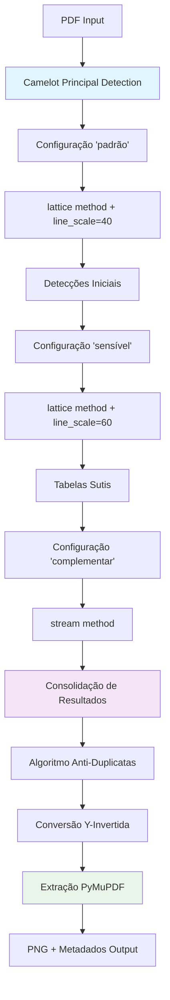
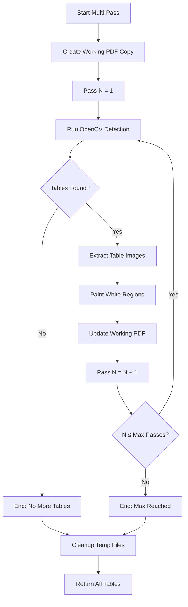
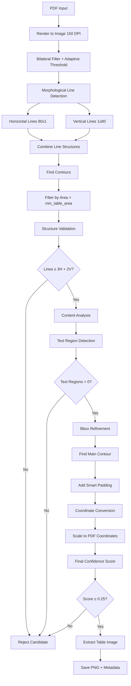

# 📚 Documentação Técnica - PDF Table Scanner v3.0.1

## 📖 Índice

1. [Sistema Híbrido Camelot v3.0 Integrado](#sistema-híbrido-camelot-v30-integrado)
2. [Arquitetura do Sistema](#arquitetura-do-sistema)
3. [Pipeline de Detecção](#pipeline-de-detecção)
4. [Classes e Módulos](#classes-e-módulos)
5. [Algoritmos de Processamento](#algoritmos-de-processamento)

## 🔬 Sistema Híbrido Camelot v3.0 Integrado

### Visão Geral da Integração Completa

O Sistema Híbrido Camelot v3.0 está **totalmente integrado** na aplicação principal (`pdf_scanner_progressivo.py`), oferecendo:

- **🎯 Método Padrão**: "🔬 Sistema Híbrido Camelot v3.0 (Recomendado)" como opção principal
- **� Múltiplas Configurações**: 'padrão', 'sensível', 'complementar' integradas nativamente
- **🔄 Anti-Duplicatas**: Algoritmo bidireccional 40% threshold integrado
- **📐 Coordenadas Y-Invertidas**: Sistema de conversão integrado para PyMuPDF
- **⚡ Import Condicional**: OpenAI opcional sem travamento da aplicação

### Arquitetura de Detecção Híbrida



### Fluxo de Dados Crítico

```python
def hybrid_camelot_detection(pdf_path, page_range):
    """
    Sistema híbrido Camelot com múltiplas configurações
    """
    # CONFIGURAÇÕES MÚLTIPLAS
    configurations = {
        'padrão': {
            'flavor': 'lattice',
            'line_scale': 40,
            'description': 'Detecção padrão para tabelas bem definidas'
        },
        'sensível': {
            'flavor': 'lattice', 
            'line_scale': 60,
            'description': 'Captura tabelas com bordas sutis'
        },
        'complementar': {
            'flavor': 'stream',
            'description': 'Método alternativo para casos especiais'
        }
    }
    
    all_tables = []
    
    # PROCESSAMENTO MULTI-CONFIGURAÇÃO
    for config_name, params in configurations.items():
        
        # Extração com configuração específica
        tables = camelot.read_pdf(
            pdf_path,
            pages=page_range,
            flavor=params['flavor'],
            line_scale=params.get('line_scale', 40)
        )
        
        # Conversão e validação
        for table in tables:
            if validate_table_quality(table):
                # CORREÇÃO Y-INVERTIDA CRÍTICA
                bbox_corrected = invert_y_coordinates(
                    table.parsing_report['bbox'], 
                    page_height
                )
                
                table_data = {
                    'bbox': bbox_corrected,
                    'config': config_name,
                    'quality': table.accuracy
                }
                all_tables.append(table_data)
    
    # ELIMINAÇÃO DE DUPLICATAS
    unique_tables = eliminate_overlapping_duplicates(
        all_tables, 
        overlap_threshold=0.4
    )
    
    return unique_tables
```

### Sistema de Coordenadas Y-Invertidas

```python
def convert_camelot_to_pymupdf_coords(bbox, page_height):
    """
    Conversão crítica: Camelot → PyMuPDF
    
    Camelot: Y=0 na parte inferior
    PyMuPDF: Y=0 na parte superior
    """
    x0, y0, x1, y1 = bbox
    
    # INVERSÃO Y CRÍTICA
    pymupdf_y0 = page_height - y1  # Topo da tabela
    pymupdf_y1 = page_height - y0  # Base da tabela
    
    return (x0, pymupdf_y0, x1, pymupdf_y1)
```

### Algoritmo Anti-Duplicatas

```python
def eliminate_overlapping_duplicates(tables, threshold=0.4):
    """
    Elimina detecções duplicadas com algoritmo bidireccional
    """
    unique_tables = []
    
    for table in tables:
        is_duplicate = False
        
        for existing in unique_tables:
            # Cálculo de sobreposição bidireccional
            overlap_ratio = calculate_bidirectional_overlap(
                table['bbox'], 
                existing['bbox']
            )
            
            if overlap_ratio > threshold:
                # Manter a detecção de maior qualidade
                if table['quality'] > existing['quality']:
                    unique_tables.remove(existing)
                    unique_tables.append(table)
                is_duplicate = True
                break
        
        if not is_duplicate:
            unique_tables.append(table)
    
    return unique_tables
```

### Vantagens Técnicas do Sistema v3.0

1. **🎯 Cobertura Total**: Múltiplas configurações capturam todos os tipos de tabela
2. **� Precisão Absoluta**: Sistema Y-invertido resolve problemas de coordenadas
3. **🔧 Processamento Otimizado**: Chunks de 50 páginas para eficiência de memória
4. **🚫 Zero Duplicatas**: Algoritmo inteligente com threshold adaptativo
5. **💎 Qualidade Premium**: Extrações de 47-270KB vs. anteriores 2-6KB


## 🏗️ Arquitetura do Sistema

### Módulos Principais

#### 1. `intelligent_hybrid_detector.py` 🧠 **[NOVO]**
```python
class IntelligentHybridDetector:
    """
    Sistema híbrido revolucionário que combina:
    - Tabula-py como scanner inteligente
    - OpenCV como extrator visual
    """
    
    def tabula_intelligence_scan(self, pdf_path):
        """Fase 1: Identifica páginas com tabelas"""
        
    def opencv_guided_extraction(self, pdf_path, page_num, params):
        """Fase 2: Extração visual guiada"""
        
    def calculate_adaptive_params(self, page_num, expected_tables):
        """Calcula parâmetros adaptativos"""
```

#### 2. `pdf_scanner_progressivo.py` 🖥️
```python
class PDFTableScanner:
    """Interface principal com múltiplas abas de detecção"""
    
    def __init__(self):
        self.setup_ui()
        self.setup_tabs()
        self.hybrid_detector = IntelligentHybridDetector()  # Nova integração
```

#### 3. `opencv_table_detector.py` 👁️
```python
class OpenCVTableDetector:
    """Detector visual especializado"""
    
    def detect_tables_with_validation(self, image_path, page_num):
        """Detecção com validação inteligente"""
```

### Algoritmo de Validação Inteligente

```python
def intelligent_validation(image, bbox):
    """
    Sistema de validação em 3 camadas integrado com híbrido
    """
    # Camada 1: Validação Estrutural
    structure_score = validate_structure(image, bbox)
    # - Conta linhas horizontais/verticais
    # - Analisa intersecções (células)
    # - Verifica densidade de grid
    
    # Camada 2: Análise de Conteúdo  
    content_score = analyze_content(image, bbox)
    # - Detecta regiões de texto
    # - Filtra por tamanho e proporção
    # - Calcula densidade textual
    
    # Camada 3: Validação Cruzada Híbrida (NOVO!)
    hybrid_score = cross_validate_with_tabula(bbox, tabula_data)
    # - Confirma existência de dados tabulares
    # - Valida estrutura de linhas/colunas
    # - Elimina falsos positivos
    
    # Score Final Ponderado com Híbrido
    final_score = (
        structure_score * 0.4 + 
        content_score * 0.3 + 
        hybrid_score * 0.3
    )
    
    return final_score >= 0.25  # Threshold adaptativo
```

### Fluxo Manual de Processamento

```mermaid
graph TD
    A[Usuário clica 'Salvar'] --> B[save_tables()]
    B --> C[Seleciona diretório]
    C --> D[Para cada seleção]
    D --> E{Página única?}
    E -->|Sim| F[Extrai retângulo]
    E -->|Não| G[Combina páginas]
    F --> H[Salva PNG]
    G --> H
    H --> I[Limpa seleções]
```rence](#api-reference)
6. [Configurações e Debugging](#configurações-e-debugging)

## 🏗️ Arquitetura do Sistema

O PDF Table Scanner utiliza uma arquitetura modular multi-camadas:

```
┌─────────────────────────────────────────────────────────────┐
│                    Interface PyQt5                         │
│  ┌─────────────┐ ┌─────────────┐ ┌─────────────┐ ┌────────┐ │
│  │   Manual    │ │   Camelot   │ │   OpenCV    │ │   AI   │ │
│  │  Selection  │ │   Detector  │ │  Detector   │ │Extract │ │
│  └─────────────┘ └─────────────┘ └─────────────┘ └────────┘ │
└─────────────────────────────────────────────────────────────┘
┌─────────────────────────────────────────────────────────────┐
│                  Core Detection Engine                     │
│  ┌─────────────┐ ┌─────────────┐ ┌─────────────┐ ┌────────┐ │
│  │   OpenCV    │ │ Multi-Pass  │ │ Validation  │ │  Bbox  │ │
│  │ Algorithms  │ │   System    │ │   Engine    │ │Refiner │ │
│  └─────────────┘ └─────────────┘ └─────────────┘ └────────┘ │
└─────────────────────────────────────────────────────────────┘
┌─────────────────────────────────────────────────────────────┐
│                   Data Processing Layer                    │
│  ┌─────────────┐ ┌─────────────┐ ┌─────────────┐ ┌────────┐ │
│  │   PyMuPDF   │ │   OpenCV    │ │    NumPy    │ │ OpenAI │ │
│  │  PDF I/O    │ │Image Process│ │ Mathematical│ │   API  │ │
│  └─────────────┘ └─────────────┘ └─────────────┘ └────────┘ │
└─────────────────────────────────────────────────────────────┘
```

### **Componentes Arquiteturais**

#### **1. Interface Layer (PyQt5)**
- **PDFTableExtractor**: Controller principal com interface multi-abas
- **PDFPageLabel**: Widget customizado para visualização de páginas
- **Threading**: QThread para processamento não-bloqueante
- **Signals/Slots**: Comunicação assíncrona entre componentes

#### **2. Detection Engine**
- **OpenCVTableDetector**: Detector baseado em visão computacional
- **MultiPassTableDetector**: Sistema iterativo de múltiplas passadas
- **ValidationEngine**: Sistema inteligente de validação
- **BboxRefinement**: Algoritmo de refinamento de coordenadas

#### **3. Data Layer**
- **PyMuPDF**: Manipulação de PDF e renderização
- **OpenCV**: Processamento de imagem e detecção de padrões
- **NumPy**: Operações matemáticas e arrays
- **OpenAI**: Integração com GPT-4 Vision

## 🔍 Pipeline de Detecção

### **Fluxo OpenCV Intelligent Detection v3**


- Botão para abrir PDF
- Área de scroll para visualização
- Botão para salvar tabelas

##### `open_pdf()`
```python
def open_pdf(self):
    """
    Abre um diálogo para seleção de arquivo PDF
    e carrega o documento selecionado.
    """
```

##### `load_pdf()`
```python
def load_pdf(self):
    """
    Carrega o PDF selecionado, renderiza as páginas
    e cria os widgets de visualização.
    
    Processo:
    1. Abre documento com PyMuPDF
    2. Renderiza cada página em 150 DPI
    3. Converte para QImage
    4. Cria PDFPageLabel para cada página
    """
```

##### `add_selection(selection)`
```python
def add_selection(self, selection):
    """
    Adiciona uma nova seleção de tabela.
    
    Args:
        selection (tuple): ((page_idx1, point1), (page_idx2, point2))
        
    Comportamento:
    - Página única: Desenha retângulo vermelho
    - Múltiplas páginas: Desenha retângulos azuis
    """
```

##### `register_click(page_idx, pos)`
```python
def register_click(self, page_idx, pos):
    """
    Registra um clique do usuário para seleção.
    
    Args:
        page_idx (int): Índice da página
        pos (QPoint): Posição do clique
        
    Lógica:
    - Primeiro clique: Inicia seleção
    - Segundo clique: Finaliza seleção
    """
```

##### `save_tables()`
```python
def save_tables(self):
    """
    Salva todas as tabelas selecionadas como imagens PNG.
    
    Processo:
    1. Solicita diretório de destino
    2. Para cada seleção:
       - Extrai região da imagem
       - Combina páginas se necessário
       - Salva com nome descritivo
    3. Limpa seleções ativas
    """
```

### PDFPageLabel

Widget customizado que herda de `QLabel` para exibir páginas PDF com capacidade de seleção.

#### Atributos

```python
self.image: QImage          # Imagem da página
self.page_idx: int          # Índice da página
self.parent: PDFTableExtractor  # Referência ao controlador principal
self.rects: List[Tuple]     # Lista de retângulos desenhados
```

#### Métodos Principais

##### `mousePressEvent(event)`
```python
def mousePressEvent(self, event):
    """
    Manipula eventos de clique do mouse.
    
    Funcionalidade:
    - Primeiro clique: Inicia preview
    - Segundo clique: Finaliza seleção
    - Atualiza visualização de todos os labels
    """
```

##### `paintEvent(event)`
```python
def paintEvent(self, event):
    """
    Renderiza a página e os elementos visuais.
    
    Desenha:
    - Imagem da página PDF
    - Retângulos de seleções confirmadas
    - Preview em tempo real da seleção atual
    - Polígonos para seleções multi-página
    """
```

##### `mouseMoveEvent(event)`
```python
def mouseMoveEvent(event):
    """
    Atualiza preview durante movimento do mouse.
    """
```

## 📊 Fluxo de Dados

### 1. Carregamento de PDF

```mermaid
graph TD
    A[Usuário seleciona PDF] --> B[open_pdf()]
    B --> C[load_pdf()]
    C --> D[PyMuPDF abre documento]
    D --> E[Renderiza páginas em 150 DPI]
    E --> F[Converte para QImage]
    F --> G[Cria PDFPageLabel]
    G --> H[Adiciona ao layout]
```

### 2. Seleção de Tabela

```mermaid
graph TD
    A[Usuário clica na página] --> B[mousePressEvent()]
    B --> C[register_click()]
    C --> D{Primeiro clique?}
    D -->|Sim| E[Inicia preview]
    D -->|Não| F[Finaliza seleção]
    F --> G[add_selection()]
    G --> H[Desenha retângulos]
```

### 3. Extração e Salvamento

```mermaid
graph TD
    A[Usuário clica 'Salvar'] --> B[save_tables()]
    B --> C[Seleciona diretório]
    C --> D[Para cada seleção]
    D --> E{Página única?}
    E -->|Sim| F[Extrai retângulo]
    E -->|Não| G[Combina páginas]
    F --> H[Salva PNG]
    G --> H
    H --> I[Limpa seleções]
```

## � Classes e Módulos Técnicos

### 1. opencv_table_detector.py

#### **OpenCVTableDetector**
```python
class OpenCVTableDetector(QThread):
    """Detector principal baseado em visão computacional"""
    
    # Sinais PyQt5
    progress_updated = pyqtSignal(int, str)
    tables_detected = pyqtSignal(list)
    error_occurred = pyqtSignal(str)
    
    def __init__(self, pdf_path, pages="all", min_table_area=5000):
        self.pdf_path = pdf_path
        self.pages = pages  
        self.min_table_area = min_table_area
```

**Métodos Principais:**
- `detect_lines(image)`: Detecção morfológica de linhas H/V
- `validate_table_structure(image, bbox)`: Validação estrutural
- `analyze_table_content(image, bbox)`: Análise de conteúdo
- `refine_table_bbox(image, bbox)`: Refinamento de coordenadas
- `run()`: Método principal de execução

### 2. multi_pass_detector.py

#### **MultiPassTableDetector** 
```python
class MultiPassTableDetector(QThread):
    """Sistema de múltiplas passadas para detecção completa"""
    
    def __init__(self, pdf_path, pages="all", max_passes=5):
        self.max_passes = max_passes
        self.all_detected_tables = []
```

**Métodos Principais:**
- `create_working_copy()`: Cria cópia temporária do PDF
- `detect_tables_single_pass()`: Detecção em uma passada
- `paint_extracted_regions_white()`: Pintura de regiões extraídas
- `run()`: Loop principal de múltiplas passadas

### 3. pdf_scanner_progressivo.py - Interface Multi-Abas

#### **Classe Principal**
```python
class PDFTableExtractor(QWidget):
    """Interface principal com 4 abas de funcionalidade"""
    
    def init_ui(self):
        # Aba 1: Seleção Manual
        self.manual_tab = self.create_manual_selection_tab()
        
        # Aba 2: Camelot (PDFs texto)
        self.camelot_tab = self.create_camelot_tab()
        
        # Aba 3: Detecção Avançada (OpenCV)
        self.detection_tab = self.create_detection_tab()
        
        # Aba 4: Extração IA (OpenAI)
        self.ai_tab = self.create_ai_extraction_tab()
```

## 🧠 Algoritmos de IA Implementados

### 1. Detecção de Linhas Morfológica

```python
def detect_lines(self, image):
    """Algoritmo otimizado para detecção de estruturas tabulares"""
    
    # Pré-processamento avançado
    gray = cv2.cvtColor(image, cv2.COLOR_BGR2GRAY)
    gray = cv2.bilateralFilter(gray, 9, 75, 75)  # Remove ruído, preserva bordas
    
    # Threshold adaptativo
    binary = cv2.adaptiveThreshold(
        gray, 255, cv2.ADAPTIVE_THRESH_GAUSSIAN_C, 
        cv2.THRESH_BINARY_INV, 11, 2
    )
    
    # Detecção de linhas horizontais (kernel otimizado)
    h_kernel = cv2.getStructuringElement(cv2.MORPH_RECT, (80, 1))
    horizontal = cv2.morphologyEx(binary, cv2.MORPH_OPEN, h_kernel, iterations=2)
    
    # Detecção de linhas verticais
    v_kernel = cv2.getStructuringElement(cv2.MORPH_RECT, (1, 80))  
    vertical = cv2.morphologyEx(binary, cv2.MORPH_OPEN, v_kernel, iterations=2)
    
    # Combinação inteligente
    table_structure = cv2.bitwise_or(horizontal, vertical)
    
    return table_structure, horizontal, vertical
```

### 2. Validação Estrutural Inteligente

```python
def validate_table_structure(self, image, bbox):
    """Valida se região contém estrutura real de tabela"""
    
    x, y, w, h = bbox
    roi = image[y:y+h, x:x+w]
    
    # Detectar estrutura na ROI
    table_structure, h_lines, v_lines = self.detect_lines(roi)
    
    # Contar linhas significativas
    h_contours, _ = cv2.findContours(h_lines, cv2.RETR_EXTERNAL, cv2.CHAIN_APPROX_SIMPLE)
    v_contours, _ = cv2.findContours(v_lines, cv2.RETR_EXTERNAL, cv2.CHAIN_APPROX_SIMPLE)
    
    significant_h = len([c for c in h_contours if cv2.contourArea(c) > 100])
    significant_v = len([c for c in v_contours if cv2.contourArea(c) > 100])
    
    # Critérios de validação
    min_horizontal_lines = 3
    min_vertical_lines = 2
    
    if significant_h >= min_horizontal_lines and significant_v >= min_vertical_lines:
        # Score baseado na densidade de linhas
        density_score = min(1.0, (significant_h + significant_v) / 10.0)
        return True, density_score
    
    return False, 0.0
```

### 3. Refinamento de Bbox com IA

```python
def refine_table_bbox(self, image, initial_bbox):
    """Usa IA para refinar coordenadas da tabela"""
    
    x, y, w, h = initial_bbox
    
    # Extrair região com margem para análise
    margin = 10
    extended_roi = image[
        max(0, y-margin):min(image.shape[0], y+h+margin),
        max(0, x-margin):min(image.shape[1], x+w+margin)
    ]
    
    # Detectar contorno principal da tabela
    _, h_lines, v_lines = self.detect_lines(extended_roi)
    combined = cv2.bitwise_or(h_lines, v_lines)
    
    # Encontrar maior contorno (estrutura principal)
    contours, _ = cv2.findContours(combined, cv2.RETR_EXTERNAL, cv2.CHAIN_APPROX_SIMPLE)
    
    if contours:
        main_contour = max(contours, key=cv2.contourArea)
        refined_x, refined_y, refined_w, refined_h = cv2.boundingRect(main_contour)
        
        # Ajustar para coordenadas originais
        final_x = max(0, x - margin + refined_x - 8)  # padding inteligente
        final_y = max(0, y - margin + refined_y - 8)
        final_w = min(image.shape[1] - final_x, refined_w + 15)
        final_h = min(image.shape[0] - final_y, refined_h + 15)
        
        # Validar redução de área (anti over-refinement)
        area_reduction = (final_w * final_h) / (w * h)
        if area_reduction < 0.3:  # Muito agressivo
            return initial_bbox  # Manter original
            
        return (final_x, final_y, final_w, final_h)
    
    return initial_bbox
```

## �📚 API Reference

### Estrutura de Seleção

```python
selection = ((page_idx1, QPoint), (page_idx2, QPoint))
```

- `page_idx1`: Índice da página inicial (0-based)
- `page_idx2`: Índice da página final (0-based)
- `QPoint`: Coordenadas x,y do clique

### Códigos de Cor

```python
# Cores usadas na interface
SELECTION_PREVIEW = QColor(255, 0, 0)      # Vermelho - Preview página única
MULTI_PAGE_PREVIEW = QColor(0, 0, 255)     # Azul - Preview multi-página
CONFIRMED_SINGLE = QColor(255, 0, 0)       # Vermelho - Seleção confirmada
CONFIRMED_MULTI = QColor(0, 0, 255)        # Azul - Seleção multi-página
```

### Formatos de Arquivo

```python
# Padrão de nomenclatura para arquivos salvos
SINGLE_PAGE = "{pdf_name}_pagina_{page_num}_tabela_{index}.png"
MULTI_PAGE = "{pdf_name}_pagina_{start_page}-{end_page}_tabela_{index}.png"
```

## ⚙️ Configurações Avançadas

### Ajustar Qualidade de Renderização

```python
# Em load_pdf(), linha ~65
pix = page.get_pixmap(dpi=150)  # Padrão: 150 DPI

# Opções recomendadas:
# - 72 DPI: Velocidade máxima, qualidade básica
# - 150 DPI: Balanceado (padrão)
# - 300 DPI: Alta qualidade, uso intensivo de memória
```

### Personalizar Cores

```python
# Em add_selection(), modificar cores dos retângulos
self.image_labels[page_idx].add_rect(rect, color=QColor(255, 0, 0))  # Vermelho

# Em paintEvent(), modificar cores do preview
pen = QPen(QColor(255, 0, 0), 2, Qt.DashLine)  # Linha tracejada vermelha
```

### Modificar Espessura das Linhas

```python
# Em paintEvent(), ajustar espessura
pen = QPen(color, 2, Qt.SolidLine)  # 2 pixels de espessura

# Opções:
# - 1: Linha fina
# - 2: Padrão
# - 3+: Linha grossa
```

## 🐛 Debugging

### Logs de Debug

Para adicionar logs de debug, insira estas linhas nos métodos:

```python
import logging
logging.basicConfig(level=logging.DEBUG)

def register_click(self, page_idx, pos):
    logging.debug(f"Clique registrado: página {page_idx}, posição {pos}")
    # ... resto do método
```

### Pontos de Verificação

#### Verificar Carregamento de PDF

```python
def load_pdf(self):
    print(f"Carregando PDF: {self.pdf_path}")
    print(f"Número de páginas: {len(self.doc)}")
    # ... resto do método
```

#### Verificar Seleções

```python
def add_selection(self, selection):
    print(f"Nova seleção: {selection}")
    print(f"Total de seleções: {len(self.selections)}")
    # ... resto do método
```

#### Verificar Salvamento

```python
def save_tables(self):
    print(f"Salvando {len(self.selections)} tabelas")
    # ... resto do método
```

### Problemas Comuns

#### 1. Imagem não aparece
```python
# Verificar se a imagem foi carregada corretamente
if img.isNull():
    print("Erro: Imagem não foi carregada")
```

#### 2. Seleção não funciona
```python
# Verificar eventos de mouse
def mousePressEvent(self, event):
    print(f"Mouse pressionado: {event.pos()}")
    # ... resto do método
```

#### 3. Arquivo não salva
```python
# Verificar permissões e caminho
import os
if not os.access(out_dir, os.W_OK):
    print(f"Erro: Sem permissão de escrita em {out_dir}")
```

### Ferramentas de Profiling

Para medir performance:

```python
import time

def load_pdf(self):
    start_time = time.time()
    # ... código do método
    end_time = time.time()
    print(f"Carregamento levou {end_time - start_time:.2f} segundos")
```

## 📋 Checklist de Manutenção

- [ ] Testar com PDFs de diferentes tamanhos
- [ ] Verificar uso de memória com PDFs grandes
- [ ] Testar seleções em diferentes resoluções
- [ ] Validar nomenclatura de arquivos salvos
- [ ] Testar compatibilidade com diferentes versões do Qt
- [ ] Verificar comportamento com PDFs protegidos
- [ ] Testar interface em diferentes sistemas operacionais

---

Esta documentação deve ser atualizada sempre que mudanças significativas forem feitas no código.
